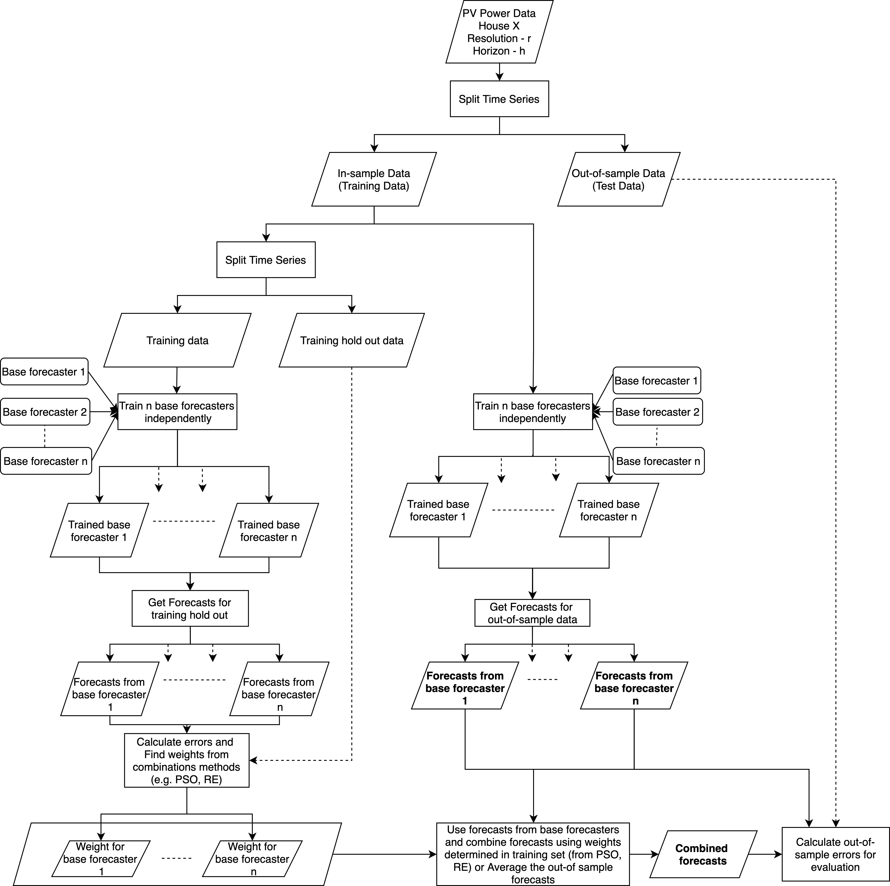
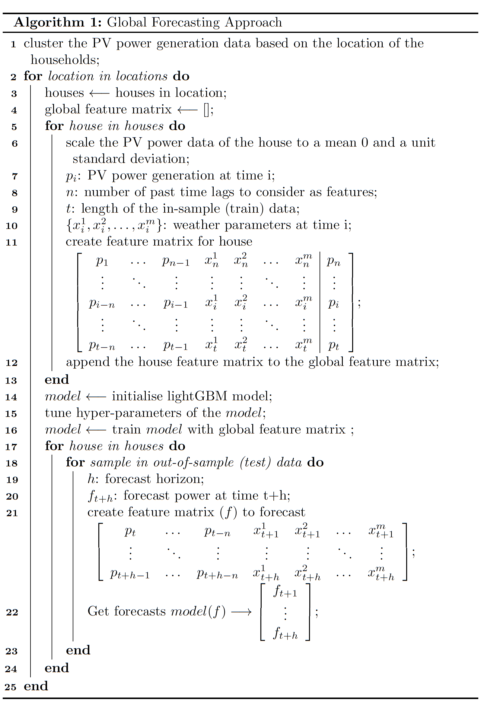
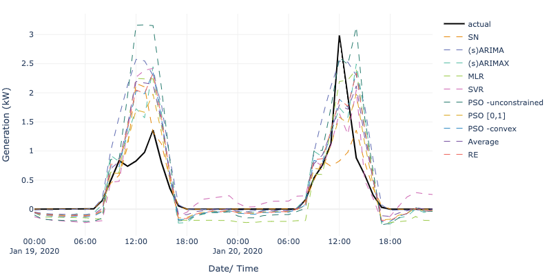

## An Ensemble Method with Optimized Weights for Forecasting Distributed Solar Photovoltaic Generation


This repository includes the code for the paper titled as "An Ensemble Method with Optimized Weights for Forecasting Distributed Solar Photovoltaic Generation"

## Methodology
#### Proposed Forecast Combination Approach 

The below figure illustrates the process of optimization-based (PSO) forecast combination approach. 


Two state-of-the-art forecast combination methods RE (Liu, L., Zhan, M., & Bai, Y. (2019). A recursive ensemble model for forecasting the power output of photovoltaic systems. Solar Energy, 189, 291-298.) and simple averaging of the forecasts are implemented for evaluation.

#### Proposed location-based Global Forecasting Approach
Algorithm 1 outlines this approach and is implemented using a LightGBM model.


## Software Requirements
Software requirements are listed in `requirements.txt`

## Execution Instructions
A example of running the code is in `main.py` for small sample dataset provided in the data folder.

#### Running the code
`python main.py`

The following is an example output of the `main.py`. It will provide the mean MASE across all test samples and a visualisation of the forecasts produced by all approaches.

```Mean Absolute Scaled Error (MASE) for the test samples```
```json
{
    "sn": 0.4617352375226971, 
    "(s)arima": 0.8710616362438794,
    "(s)arimax": 0.7290526167551878, 
    "mlr": 0.9119233826493682, 
    "svr": 0.8491110380174636, 
    "pso- unconstrained": 1.0867953618937825, 
    "pso [0,1]": 0.4541319252235865, 
    "pso- convex": 0.6832882493648744, 
    "average": 0.6411990407241464, 
    "re": 0.7161379879466082,
    "lgb": 1.4269188941948645
}
 ```
```Visulatisation of the forecasts produced by all approaches``` 


## Directory Structure
```
|-main.py - example code to run all forecast approaches and visualise
|-data - data folder
|-constants.py - constants related to the project
|-plot.py - functions related to plotting
|-run_base_models.py - code to run all base learners
|-run_combinations.py - code to run all forecast combination methods
|-timeseries_split.py - class to split time series data
|-run_global_models.py - code to run global models
|-forecast_combinations_approach - code for the forecast combination approach (this runs the run_bse_models and run_combinations)
|-global_forecast_approach - code for the gloabl forecast approach (this runs the run_global_models)
|-util.py - additional functions
|-boosting - python class implementation of the LightGBM model
|-combinations - class implemenations for average, pso methods and recursive ensemble
|-machine_learning - class implementations for linear and support vector regression models
|-naive_models - class implementation of the seasonal naive model
|-tsmodels - class implenation of the (s)ARIMA and (s)ARIMAX models
```

## Executing With Your Own Data

1. Add your data to the `data` folder as per the provided example
2. Add the corresponding external variables to the `data` folder as per the provided example
3. Update the `HORIZON_INFO` dictionary in `constant.py`. This dictionary contains the following parameters.
```
'1D' - A string identifier corresponding to the forecast horizon. Has to be a python recognized timedelta format
'resolution' - A string identifier for the resolution of the data (e.g. H, min, D)
'horizon_as_int' - An integer value corresponding to the number of steps to forecast in the horizon
'resolution_as_str' - A string identifier corresponding to the resolution of the data. Has to be a python recognized timedelta format
'seasonality' - An integer value for the seasonal frequency of the data
'arima_params': {
            'seasonal_freq': An integer value noting the seasonal frequency of the data for a SARIMA model
            'seasonality': A boolean value indicating whether to fit a non-seasonal or seasonal model (True if a seasonal model is required, else False)
            'fourier': A boolean value whether to fit a fourier series as the seasonality (important when dealing with long seasonalities)
            'fourier_terms': None or an integer indicating the number fourier terms when the seasonality is modelled as a fourier series
            'maxiter': None or an integer indicating the number of iterations to perform when updating an ARIMA/SARIMA model
        }
```

**Notes**: 

The values for the following parameters have been reduced for a faster execution. Increase the value of these parameters to a value `> 100` when executing the code with large amount of data.
```
Class pso_model.py - iterations, hyper_parameter_iter
Class lightgbm.py - init_points, n_iter 
```
There should be data for more than 1 PV system to run the proposed location-based global forecasting approach.

Change the number of training, testing days passed to the `TimeSeriesDivide` function based on your desired evaluation period
